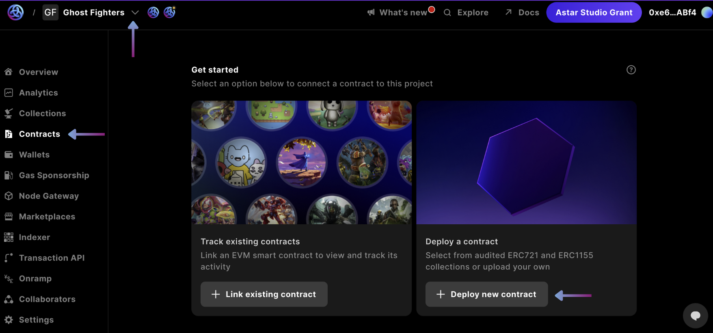
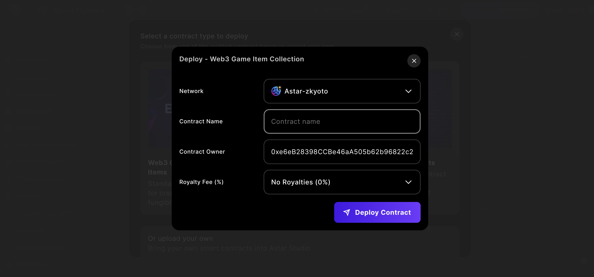
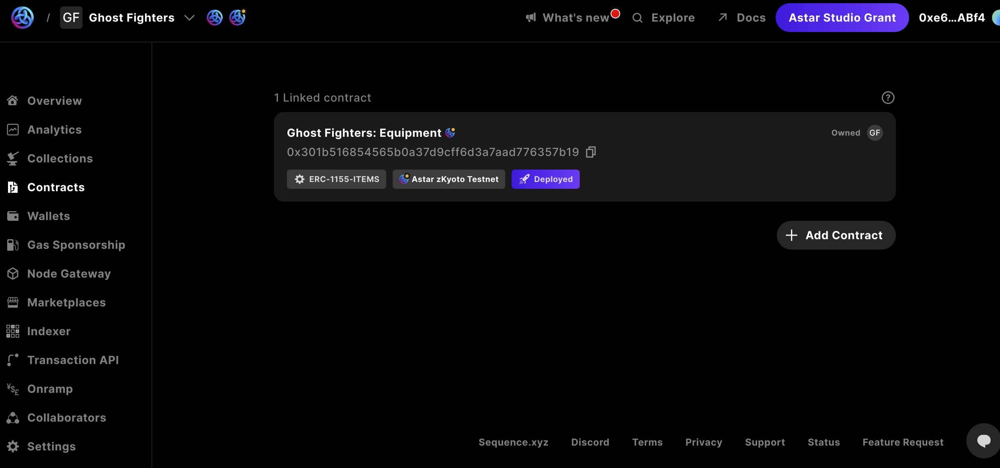
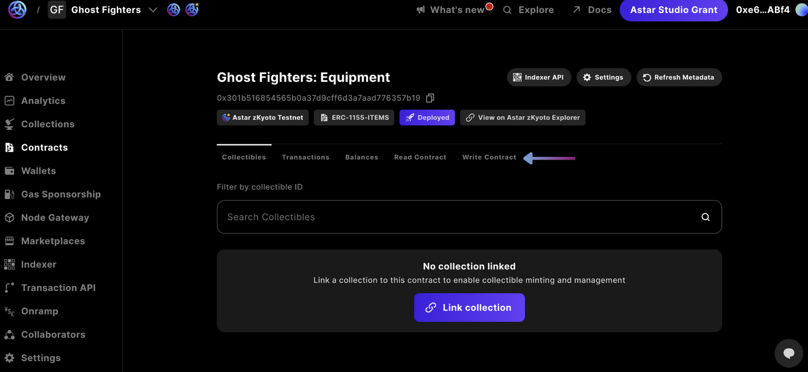
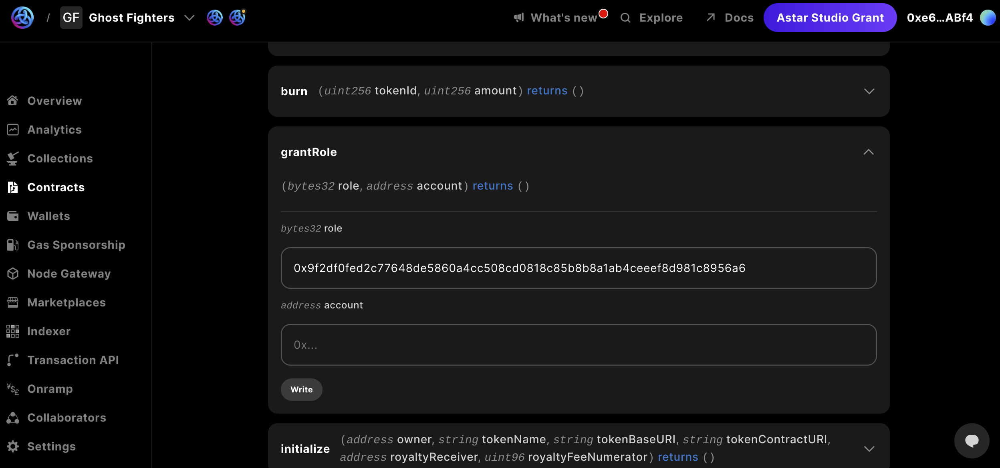
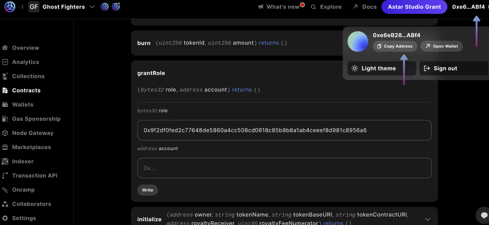
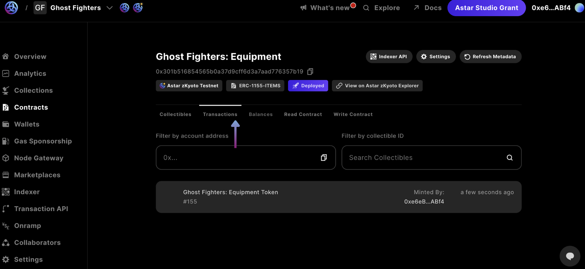

# Deploy Item Collection Contract with Astar Studio

This guide walks through how to setup and deploy a Web3 Game Item contract in Astar Studio with Astar zKyoto testnet.

:::warning
Prerequisite: Create a Project

This guide assumes that you have already [signed up for Astar Studio and created a Project](.././../astar-studio/quickstart.md#4-create-a-project).
:::

#### ERC721 vs. ERC1155

Both contracts mint NFTs, but ERC721, being the earlier standard, has gained widespread adoption, particularly in digital collectibles. Known for its simplicity and ease to audit for security, ERC721 tokens are distinct, contributing to their recognition in various NFT marketplaces. Typically you would use an ERC721 contract if: you're dealing with the single same asset, multiplied, or a multiplicity of 1 item with many in a collection

Example `ERC721`: [Azuki](https://etherscan.io/token/0xed5af388653567af2f388e6224dc7c4b3241c544)

In contrast, ERC1155 offers versatility with efficient batch operations for both fungible and non-fungible tokens in a single contract, where typically you would be dealing with a multiplicity of a many items to many quanties relationship. However, this flexibility introduces complexity, necessitating careful security attention.

Example `ERC1155`: [Skyweaver](https://polygonscan.com/token/0x631998e91476da5b870d741192fc5cbc55f5a52e)

## 1. Navigate to contracts

Start by selecting your `project` in the top left and corner for what you want to create the collectible for, and head to the `contracts` section and select `+ Deploy new contract`

## 2. Choose your collectible type

Then make your choice of Web3 Game Item Collection (ERC1155) or NFT Collection (ERC721), for this example we'll walk you through a Web3 Game Item Collection (ERC1155)

:::warning
  The only difference in deployment between an `ERC1155` vs `ERC721` is that you
  add a `symbol` to an ERC721 NFT Collection
:::

## 3. Specify contract details

Complete the contract details by specifying a `Contract Name` and `Owner` for your contract, with the option to input Royalties. Make sure the Owner address is your Wallet address in the top-right hand corner and that you have funds in this wallet on mainnet, otherwise on testnet - we sponsor these transactions for you.

:::danger

Note:

While you can change the `name` later in the studio interface where it will update across the stack, popular explorers do not reindex the information, so what you put first remains

:::

## 4. Deploy your contract

Deploy your contract from the popup window and sign the message by selecting `confirm`

:::info

The astar-zkyoto is free to transact on.

:::

## 5. Add a Minter Role to the contract

First start by selecting your contract you just deployed in the `contracts` section

Next, head to the `Write Contract` section

In the `grantRole` section of the write contract tab navigation

Complete with the following details:

`bytes32 role`: `0x9f2df0fed2c77648de5860a4cc508cd0818c85b8b8a1ab4ceeef8d981c8956a6`
`address account`: `<Wallet Address>`

Where the wallet address is the address that you would like to give permissions to mint to.

Complete by selecting `write` and signing the transaction in the popup window, like before

With a confirmation message showing `Response Success`

:::info
  The role string inputted is the result of `keccak256("MINTER_ROLE")` in
  solidity or `ethers.utils.keccak256(ethers.utils.toUtf8Bytes("MINTER_ROLE"))`
  in javascript
:::

## 6. Mint tokens to your wallet address

Navigate to the `mint` card in the `Write Contract` section and input the `to` being the wallet address you would like to receive the token to, the `tokenId` (typically starting at 0), and `amount` of tokens, and finally the `data` section you can just input `0x00`, which typically represent Additional data with no specified format.

## 7. Confirm your minted collectible

And you're done!

You can view the transactions submitted to the blockchain for your wallet address in the `Transactions` tab navigation

## Next Steps

Congratulations! You are now a dApp developer on Astar network 😎 To better make use of and expand on your new skills as a smart contract developer, we recommend diving further into our official documentation and builders guides, and joining our Discord to share ideas with other developers, or to receive technical support.
