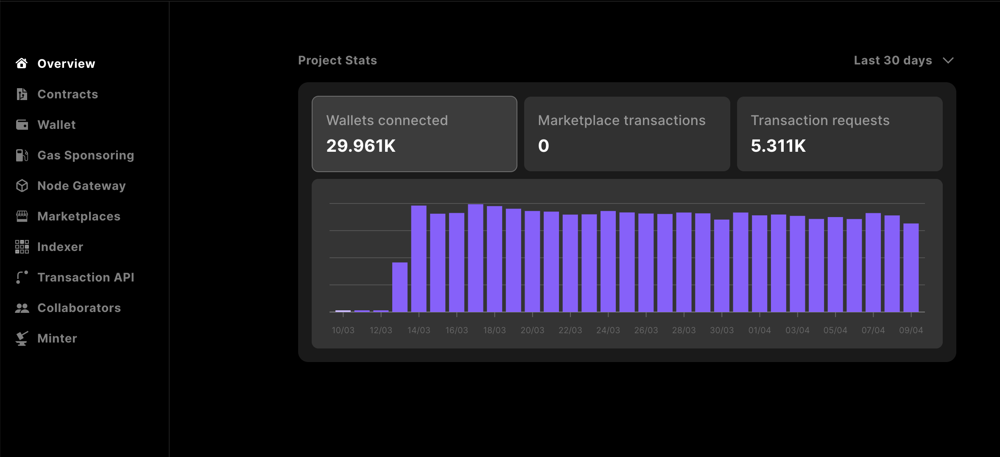
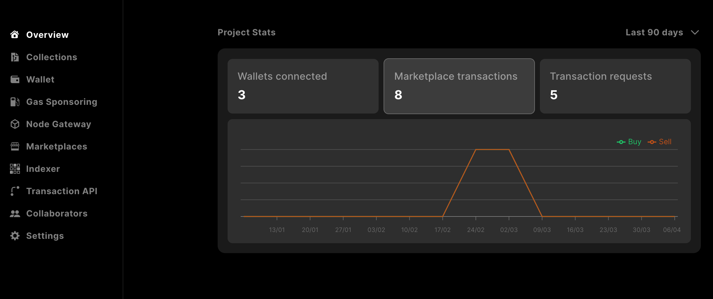
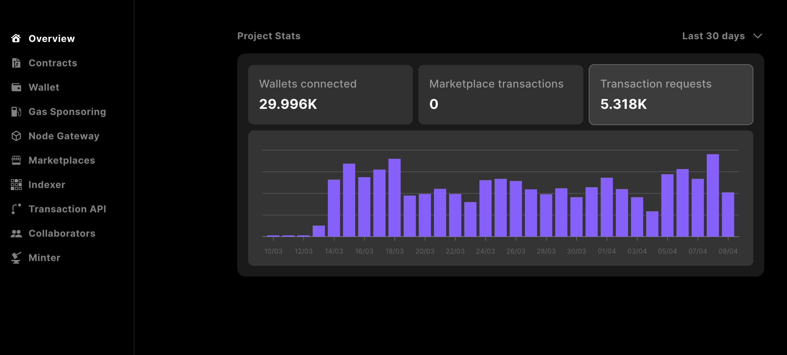

# Analytics
When you use Astar Studio to build your applications, you can see key insights in Astar Studio.
You don't need to do any additional work to see valuable metrics about your project, such as the number
of connected wallets or daily transaction requests.

#### How it works

When requests are made with Astar Studio SDKs/APIs, analytics events are fired and sent to our internal analytics system, Databeat.

Databeat anonymizes the data and stores it in a secure database designed for high-volume, real-time applications. The metrics you see in Astar Studio are 
queried from the database, in real-time, for your project and presented in insightful visualizations. 

## Overview

In the Overview tab of Astar Studio, you will see the key, high-level metrics for your project. Metric cards will show the total value for that metric, and
clicking on one will change the chart to show time-series data for that metric. 

:::tip 
You also have the option to look back at your data beyond the default **Last 30 days** 
by toggling the filter in the top right corner. 
:::

#### Wallets connected
*Wallets connected* represents the count of distinct wallet addresses connected via Sequence SDKs for the selected time period. 

#### Marketplace transactions
*Marketplace transactions* shows the total number of buy and sell events that occur via the Sequence Marketplace API.

#### Transaction requests

*Transaction requests* represents the total number of transactions sent by wallets associated with the project.

