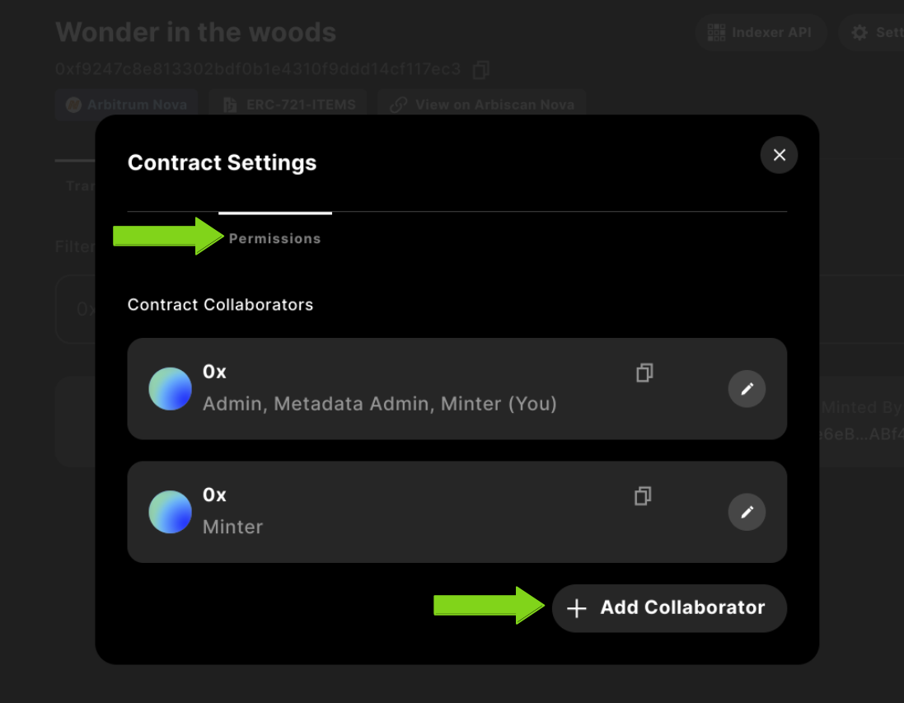
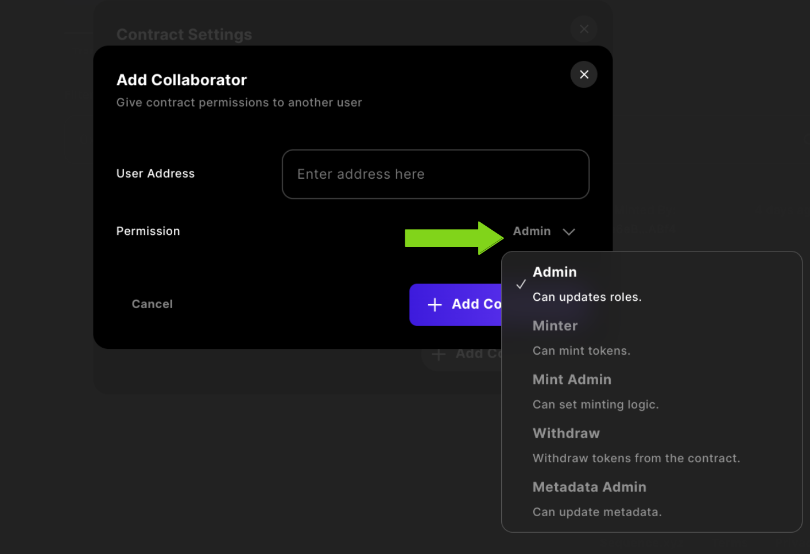
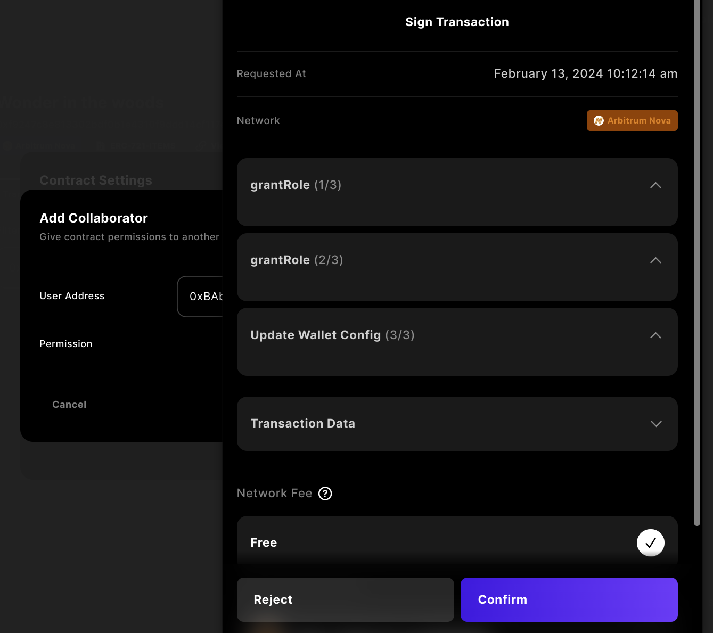

## Add Contract Collaborators to Contracts

Once you have a contract selected from one of the templates deployed, you can navigate to the specific contract and select the settings to view Permissions.

Once you have the modal open, select the `Permissions` tab and you can `Edit`, or, `+ Add Collaborator`.

Then complete the form with the user's address you want to add as a collaborator and select the dropdown to assign a new role.

##### Possible roles

- Admin: Can update roles
- Minter: Can mint tokens
- Mint Admin: Can set minting logic
- Withdraw: Withdraw tokens from the contract
- Metadata Admin: Can update metadata

Finally, complete and sign the transaction to be deployed to the network the contract is deployed on.

