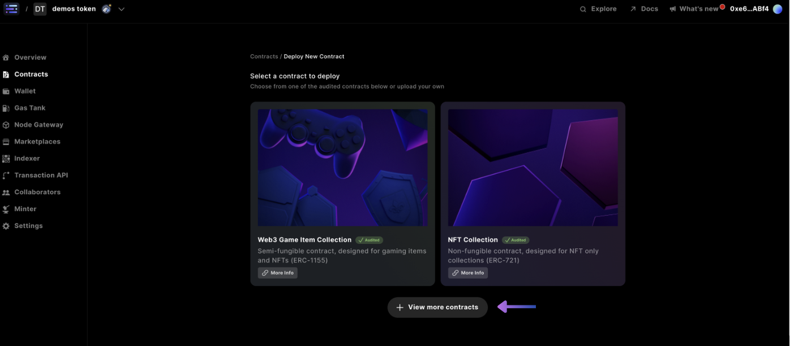
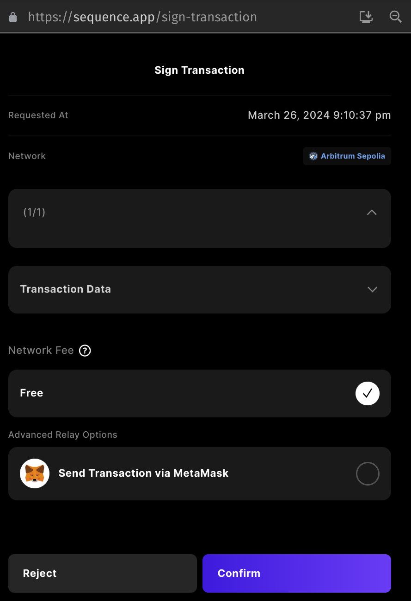

# How to Deploy In-game Currency in Astar Studio

## Introduction

In this guide, we'll walk you through the process of creating your own in-game currency through deploying and minting from an ERC20 contract.

Currency tokens add new and interesting dimensions to in-game economies, transactions, and player interactions to unlock and distribute value.

#### What is an ERC20 token?

An ERC20 token is a digital coin - what makes it special is that it follows a [set of rules called ERC20](https://ethereum.org/en/developers/docs/standards/tokens/erc-20/), making it easy to use in different places on the internet. These tokens often represent value or be used for specific purposes. Unlike the other common token - NFT's, these tokens are fungible.

#### Fungibility vs Non-Fungibility

This is the key distinction to understand.

Fungible tokens (like ERC20 tokens) are interchangeable, and each unit is the same as every other unit, just like dollars or euros. They can easily be split or combined into different quantities.

Non-fungible tokens (like ERC721 tokens) represent unique items with individual properties, such as digital art or collectibles. Each token is distinct and not directly exchangeable with another on a like-for-like basis.

:::warning
Prerequisite: Create a Project

This guide assumes that you have already [signed up for Astar Studio and created a Project](../quickstart.md#4-create-a-project).
:::

## Step 1: Navigate to contracts

Start by selecting your `project` in the top left and corner for what you want to create the currency for, and head to the `contracts` section and select `+ Deploy new contract`

## Step 2: Select Currency Token

Click `View more contracts`

Select the Currency Token contract and click `deploy` to deploy your [Sequence](https://sequence.xyz) audited contract

## Step 3: Specify contract details

Complete the contract details by specifying a `name` and `symbol` for your contract. 

:::danger

Note:

While you can change the `name` and `symbol` later in the Astar Studio interface where it will update across the backend sequence stack, popular explorers do not reindex the information, so what you put first remains

:::

## Step 4: Deploy your contract

Deploy your contract from the popup window at http://sequence.app/sign-transaction, and sign the message by selecting `confirm`

:::info

The astar-zkyoto is free to transact on.

:::

## Step 5: Add a Minter Role to the contract

First start by selecting your contract you just deployed in the `contracts` section

Next, head to the `Write Contract` section

In the `grantRole` section of the write contract tab navigation, complete with the following details:

`bytes32 role`: `0x9f2df0fed2c77648de5860a4cc508cd0818c85b8b8a1ab4ceeef8d981c8956a6`
`address account`: `<Wallet Address>`

Where the wallet address is just copied from the top right hand corner to be able to send tokens to your wallet

Complete by selecting `write` and signing the transaction in the popup window, like before

With a confirmation message showing `Response Success`

:::info
  The role string inputted is the result of `keccak256("MINTER_ROLE")` in
  solidity or `ethers.utils.keccak256(ethers.utils.toUtf8Bytes("MINTER_ROLE"))`
  in javascript
:::

## Step 6: Mint tokens to your wallet address

Navigate to the `mint` card in the `Write Contract` section and input your wallet address that you would like to receive tokens to and amount of tokens in 18 decimals. So for 100 tokens you would input: `100000000000000000000`

## Step 7: Confirm your minted currency

And you're done!

You can view the transactions submitted to the blockchain for your wallet address in the `Transactions` tab navigation

