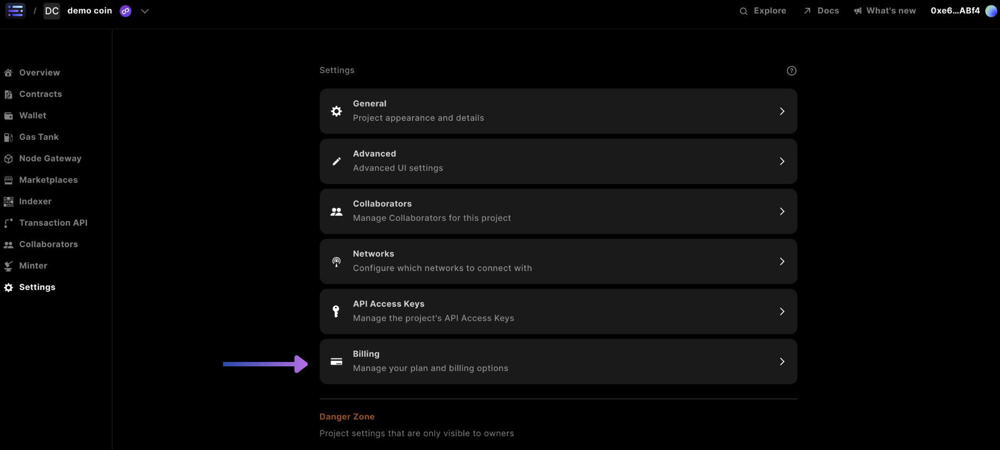
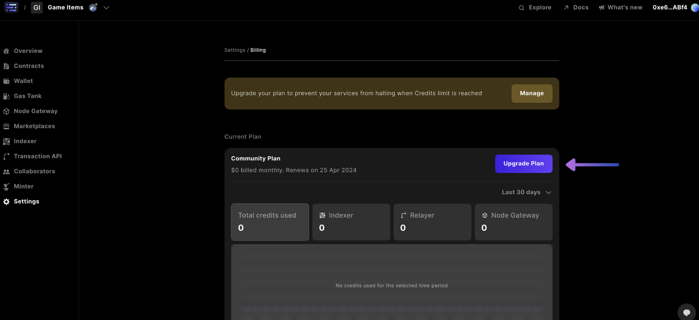
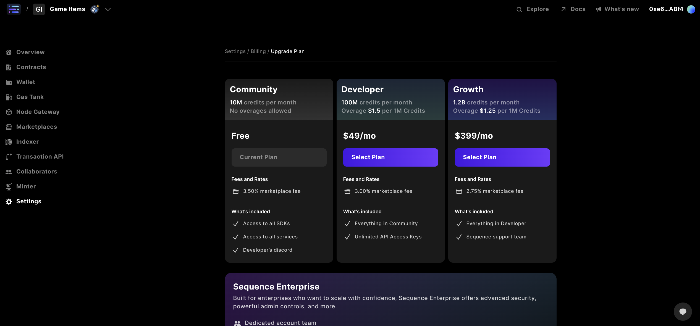
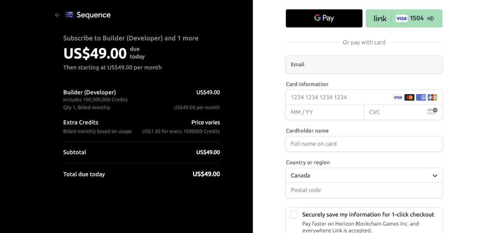
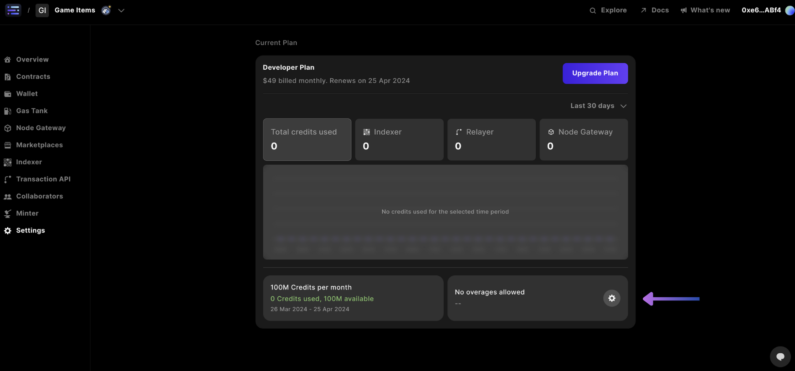
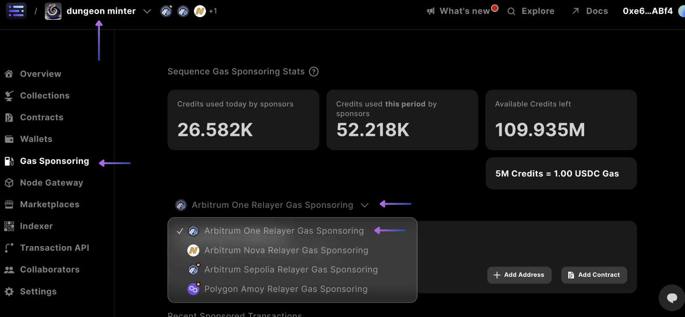
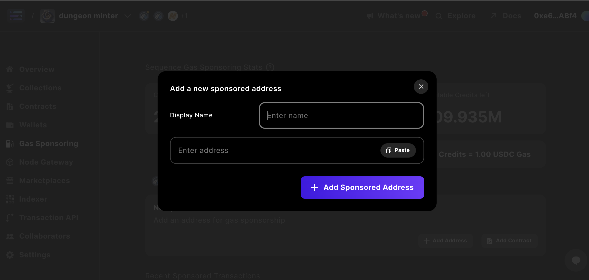
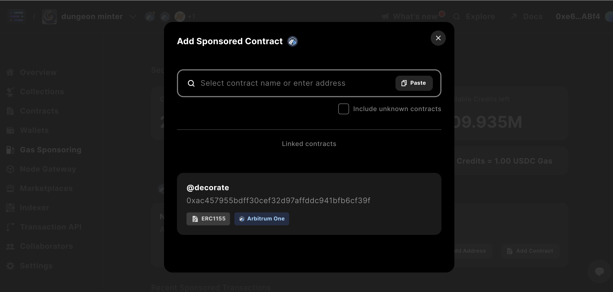

# Gas Sponsorship

Sequence wallets - offered via the Astar Studio - are controlled by smart contracts, enabling transaction fees to be abstracted away from users, a concept known in web3 as _gas_. With Astar Studio's Gas Tank, you have a streamlined process for sponsoring gas for your users.

##### Why would I want to sponsor gas for my game?

Obtaining the crypto needed to cover fees poses a challenge for traditional gamers. Sponsoring gas on their behalf solves this problem.

Gas sponsoring in a web3 game provides seamless onboarding by removing gas fees, making transactions efficient and cost-effective for trading virtual assets in various in-game activities. This creates a more enjoyable gaming experience, fostering player loyalty and community engagement.

##### Sponsoring gas with the Gas Tank

Sponsoring gas on contracts is easy, and can be done either by searching and adding a contract or selecting a contract that you have already deployed on a project. Project owners also have control over the contracts they sponsor, allowing them to temporarily disable a sponsor for a specific contract by toggling it off and updating the sponsor settings.

## How to Sponsor a Contract

### 1. Create or Select Project

To create a project, follow [this walkthrough](./quickstart#4-create-a-project)

If you have a project already, sign in and select from the listed projects

### 2. Upgrade Billing

Open your Billing settings.

In here, you are given all of subscription plan information that you need.

You can also [update your subscription](./gas_sponsorship.md#update-your-project-subscription-plan), and [set your overage limits](./gas_sponsorship.md#set-your-overage-limit).

#### Billing information

In the billing section, you can quickly access key information about your subscription plan:

- Current subscription plan
- Current billing period dates
- Monthly billing amount
- Next renewal date
- Monthly credits issued
- Credits used in the current period
- Remaining credits
- Overage settings status

##### Update your Project Subscription Plan

To update your project subscription plan, make sure you have selected the correct `project` accessed `Settings`, and are in the `Billing` section.

Start by clicking on the `Upgrade Plan` button.

This will take you to our plans dashboard, where you can review the plans and select the one that works best for you.

Once you know which plan you want, click the `Select Plan` button.

This will take you to a checkout screen where you can enter your payment information.

##### Set your Overage Limit

To set your overage limit, make sure you have selected the correct `project`, accessed `settings`, and are in the `billing` section. you will also need a paid plan to set an overage limit.

With a paid plan, start by clicking on the button with the gear icon.

Toggle the `Set overage limit` option.

Then enter the maximum overage amount that you would like to set.

Finish by clicking the `Save changes` button.

### 3. Select Relayer Network

After selecting a project, go to the `Gas Sponsoring` page, and select from the relayer dropdown the network

### 4. Sponsor Contract Address

Then, either `+ Add Address` from a contract not already linked to your project

Or, `Add Contract` from an already `Linked` contracts

