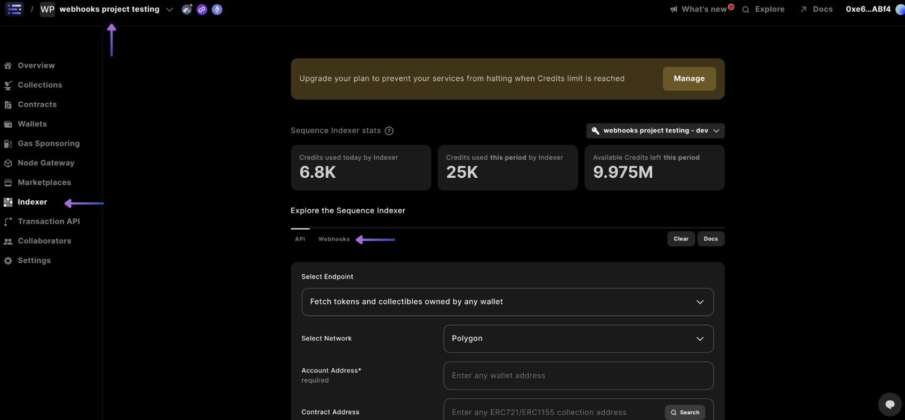
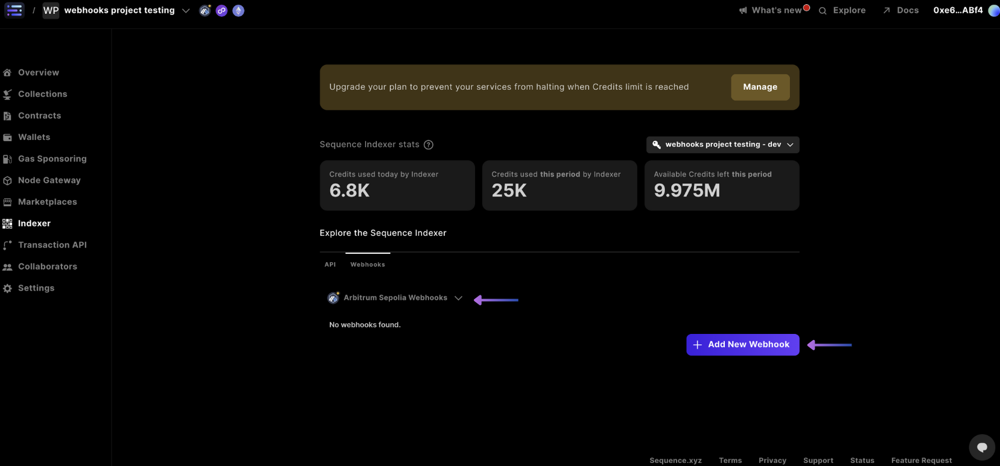
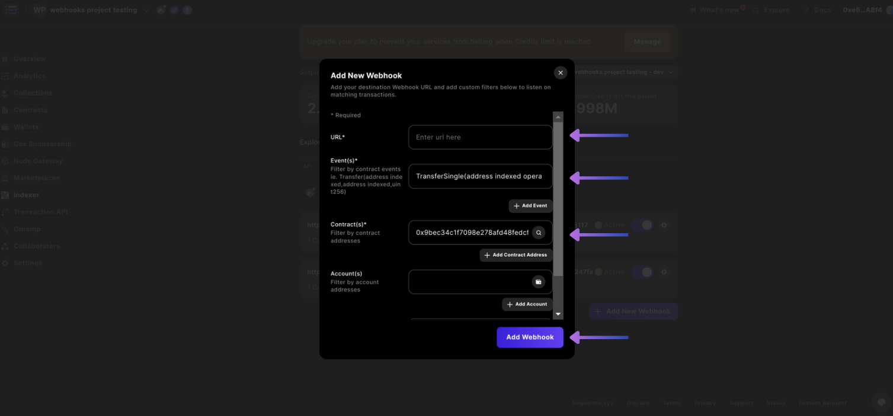
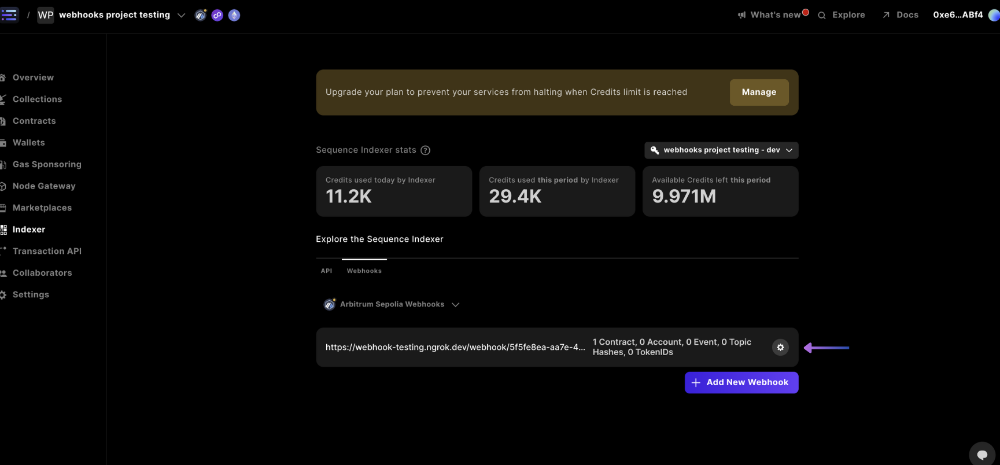
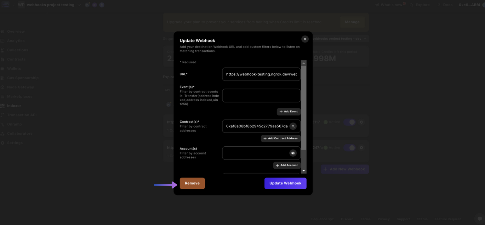

# Webhooks in Astar Studio

Astar Studio equips game builders with an indexer that listens to events across the many blockchains that we offer by providing an https callback.

#### What data can I listen to for my game?
- Mints from a contract
- TokenID transfers
- Transactions by an account address
- Event topics emitted by a contract
- Event topic hashes emitted by a contract

## Creating Webhooks

The following steps guide you through creating your webhook

1. [Select Project and go to Webhooks Section](./no_code_webhooks.md#select-project-and-go-to-webhooks-section)
2. [Select Network and Add New Webhook](./no_code_webhooks.md#select-network-and-add-new-webhook)
3. [Complete Webhook Details](./no_code_webhooks.md#complete-webhook-details)

### 1. Select Project and go to Webhooks Section

Select your project in the top left hand corner, select the `Indexer` section in the sidebar, and select the `Webhooks` tab.

 
### 2. Select Network and Add New Webhook

In the dropdown beneath the webhooks tab, select the network you're looking to create a webhook for based on the ones in your project, then `+ Add New Webhook`

 
### 3. Complete Webhook Details
Complete the required details like webhook `URL` and `Contract Address(es)` and select `Add Webhook`

:::info
    If you require a webhook endpoint you can use [webhook.site](https://webhook.site/)
    
    Or, you can use template code with one of the following:

    [Nodejs TypeScript Webhook](https://github.com/0xsequence-demos/template-nodejs-webhook-server) (combined with [ngrok](https://ngrok.com/))
    [Cloud Worker Webhook](https://github.com/0xsequence-demos/template-cloudflare-worker-webhook)
:::

And you're done!

## Removing or Updating Webhooks

The following steps guide you through creating your updating or removing your webhook

1. [Select Project and go to Webhooks Section](./no_code_webhooks.md#1-select-project-and-go-to-webhooks-section)
2. [Select the Gear to Update or Remove your Webhook](./no_code_webhooks.md#2-select-the-gear-to-update-or-remove-your-webhook)
3. [Update or Remove Webhook](./no_code_webhooks.md#3-update-or-remove-webhook)

### 1. Select Project and go to Webhooks Section

Select your project in the top left hand corner, select the `Indexer` section in the sidebar, and select the `Webhooks` tab.

### 2. Select the Gear to Update or Remove your Webhook
In the webhooks screen, select the gear `⚙` for the webhook you want to remove or update

### 3. Update or Remove Webhook

Then you can either `Update Webhook` or `Remove` your webhook by selecting either option

