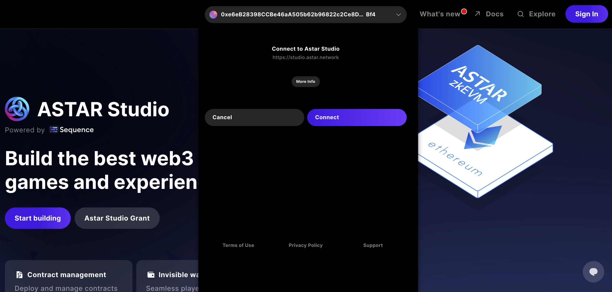

# Quickstart: Project & Access Key Management

# Get Started

Signing up and creating a project is easy to do with Astar Studio and should take you less than a few minutes. In this tutorial, we will help you sign up for Astar Studio and then create your first project.

## Sign Up Index
1. [Access studio.astar.network](./quickstart.md#1-access-studioastarnetwork)
2. [Choose a Sign in Method](./quickstart.md#2-choose-a-sign-in-method)
3. [Sign in to studio.astar.network](./quickstart.md#3-sign-in-to-astar-studio)
4. [Create a Project](./quickstart.md#4-create-a-project)
5. [Claim an API Access Key](./quickstart.md#5-claim-an-api-access-key)
6. [(Optional for Development) Create a Service Account](./quickstart.md#6-optional-for-development-create-a-service-account)

Let's get started!

## Sign Up for Astar Studio

### 1. Access [`studio.astar.network`](https://studio.astar.network/)

Go to [studio.astar.network](https://studio.astar.network/) and click on the `Start Building` or `Sign in` button to get started.

### 2. Choose a Sign In Method

When you first sign in to Astar Studio, a wallet is created for you.

You may, however, already have a Sequence wallet. If you are signed in with that wallet, you will see an option to use it.

Without a wallet, you will be given a few options to sign in. You can use any of the social sign ins, or you can simply use your email to get started.

### 3. Sign In to Astar Studio

After choosing how you would like to sign in, you will be presented with the terms of use. To read the `Terms of Use`, `Privacy Policy`, and `Master Services Agreement`, click on the respective links for each.

Once you have read each, click through to continue.

You are now signed in to Studio!

## 4. Create a Project

Everything you do in Studio is centered around each project - so let's start one.

The easiest way to start a project is to simply click `+ Create Project`.

### Enter the Project Details

A modal will pop up, allowing you to enter details about your project. Provide a project name and, if you like, add an avatar for the project.

Then, select the network(s) on which you would like to start deploying. This can always be changed later.

### Create the Project!

Now hit the `Create new Project` button!

Once you finish, you should now be viewing your project dashboard.

## 5. Claim an API Access Key

Finally, to start building you'll need to claim an access key from the Studio, which can be accomplished by navigating to your `project` in the top left corner, selecting `Settings` in the side nav, and selecting the `API Access Keys` card

Within the `settings` of the `API Access Keys` select the `dev` access key, which is typically used for development environments, whereas the `prod` key is used for production environments for applications in front of your users.

## 6. (Optional for Development) Create a Service Account

In order to integrate some services from the Sequence stack, a Service Account has to be created to make updates or read from state - including [Collections API](./manage_collections.md) or [Webhooks](./querying-blockchain-data//examples/programmatic_webhooks.md) - a `Secret API Key` is required.

One can navigate to the API Access Keys section by selecting the project, accessing the sidebar nav page of `Settings`, and selecting the `API Access Keys` card

And scroll to the bottom, where you will find the `Secret API Access Key(s)` section 

Where you would select `+ Add Service Account`

And either create a `Read` key, or, a `Write` secret API access key. 

For making updates to the Sequence system, select `Write` and `+ Add Service Account` to include in your integration.

Copy the JWT token and save it somewhere safe, or, in your project 

:::warning
  Warning: You won't have access to the generated `Secret API Access Key` in the future from the Studio interface, make sure to save it somewhere safe.
:::