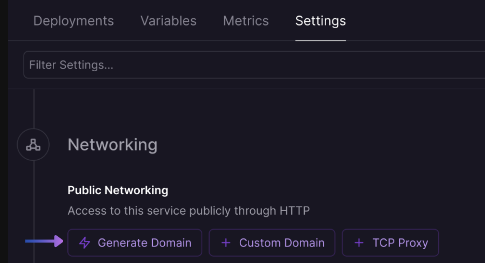
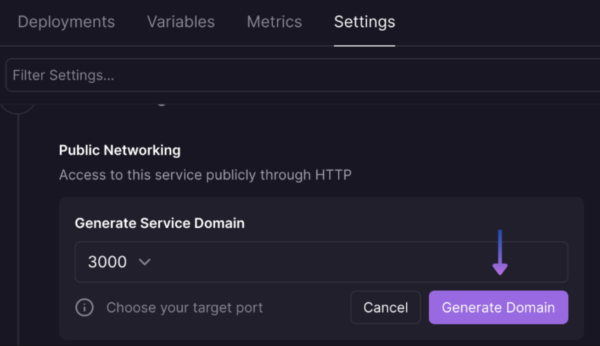

# Transaction Manager

The Astar Transaction Manager offers a simple interface for dispatching transactions on Ethereum-compatible networks - specifically astar-zkevm and astar-zkyoto - to service your game or app and scale to millions of users that brings an enormous amount of benefits.

## Benefits
- Gas abstraction -- whereby users can pay for network gas in a variety of tokens (ie. USDC, DAI, etc.)
- Sponsored gas -- projects may sponsor the gas of specific contracts to allow free gas for their users
- Batched transactions -- group a bunch of independent transactions and allow them to be mined as a single transaction
- Parallel transactions -- parallelize the dispatch of transactions in some cases
- Fire + forget model -- easily send transactions to the transactions api which will automatically manage nonces, bump gas, and other features which will ensure fast delivery
- Optimal gas pricing for transactions -- will be attempted once and if not included from the mempool within 3 blocks, the transaction will be resubmitted

The only difference with respect to deployed EVM contracts: transactions with a Transaction Manager will have the `msg.sender` as one of the Sequence Relayer addresses, which can be seen in any one of the status pages: for example [on Astar zkEVM](https://astar-zkevm-relayer.sequence.app/status) with the `senders` array.

## Quickstart

### Try your own Deployable Template 

#### 1. Access Railway Template

Try out the Transaction Manager with [your own deployed template](https://railway.app/template/EzeuAo)

#### 2. Astar Studio Project Management

Create a project using this [walkthrough](./quickstart#4-create-a-project).

What network you assign to the project should be used for `CHAIN_HANDLE`, either `astar-zkevm` or `astar-zkyoto`.

#### 3. Access Key Management

Obtain a Project Access Key using this [walkthrough](./quickstart#5-claim-an-api-access-key).

This should be used for `PROJECT_ACCESS_KEY`.

#### 4. Deploy an ERC1155 or ERC721 Collectible Contract

Deploy a collectible contract by following this [walkthrough](./deployable-contracts/deploy_collectibles_contract).

This contract should be used for `COLLECTIBLE_CONTRACT_ADDRESS`.

#### 5. Complete Railway Template Variables
Use all the values from the previous steps to complete and deploy the online template with the `Deploy` button.

#### 6. Update Exposed Port in Interface
Access settings for your deployment and update the exposed port to `3000`:

##### Generate Domain


##### Set Port


#### 7. Perform a Mint Transaction

Using a command line interface, call the server using cURL to mint to a wallet address, where a `tokenID` parameter is only used if the contract is an ERC1155:

```shell
curl -X POST https://<DEPLOYED_RAILWAY_URL>/mint \
-H "Content-Type: application/json" \
-d '{"evmAddress": "<EVM_WALLET_ADDRESS>", "tokenID": "<TOKEN_ID>", "contractAddress":"<COLLECTIBLE_CONTRACT_ADDRESS>", "isERC1155": "<true_OR_false>", "amount":<AMOUNT> }'
```

Input an `EVM wallet address`, `token ID`, `collectible contract address` (either a Astar Studio ERC721 or ERC1155), `true` or `false` for `isERC1155`, and the `amount` of tokens to transfer into the above request and mint!

You should recieve a response with a `txHash`:

```shell
{"txHash":"<TX_HASH>"}
```

:::info
The Transaction Manager template will accept requests from all origins.
:::

## Boilerplate Source Code

Want to further customize and take your code to production? There's a single step to make this production ready for Web applications:

### Restrict Origin from a Frontend Code

Update the following line of code from `*` to include the `requesting origin domain` of the deployed application in the following [line of code.](https://github.com/0xsequence-demos/tx-manager/blob/master/server/server.ts#L44)

:::info
Get started quickly with the source code of the [template](https://github.com/0xsequence-demos/tx-manager) using the Transactions API.
:::